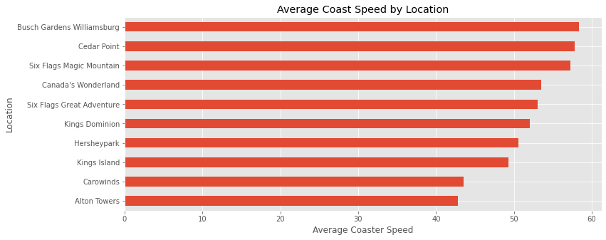

# Steps

## Imports & Settings

```py
import pandas as pd
import numpy as np
import matplotlib.pylab as plt
import seaborn as sns
plt.style.use("ggplot")
pd.set_option("display.max_columns", 100)
```

## **Understanding Data**

### Get Data

```py
df = pd.read_csv("file_name.csv")
```

### Row and Columns

```py
df.shape
```

### Preview

```py
df.head()
```

### Columns

```py
df.columns
```

### Types

```py
df.dtypes
```

### Brief Description

```py
df.describe()
```

## **Data Preperation**

1. Dropping irrelevant columns and rows
2. Identifying duplicated columns
3. Renaming Columns
4. Feature Creation

### Dropping the columns do it like this to know which ones are present and which were dropped

```py
df = df[['coaster_name',
    # 'Length', 'Speed',
    'Location', 'Status',
    # 'Opening date',
    # 'Type',
    'Manufacturer',
    # 'Height restriction', 'Model', 'Height',
    # 'Inversions', 'Lift/launch system', 'Cost', 'Trains',
    # 'Duration', 'Capacity', 'G-force', 'Designer'
    # 'Drop', 'Soft opening date', 'Fast Lane available', 'Replaced',
    # 'Track layout', 'Fastrack available', 'Soft opening date.1',
    'year_introduced',
    'latitude', 'longitude',
    'Type_Main',
    'opening_date_clean',
    #'speed1', 'speed2', 'speed1_value', 'speed1_unit',
    'speed_mph',
    #'height_value', 'height_unit',
    'height_ft',
    'Inversions_clean', 'Gforce_clean']].copy()
```

### Change types

```py
df["opening_date_clean"] = pd.to_datetime(df["opening_date_clean"])
```

### Rename

```py
df = df.rename(columns={'coaster_name':'Coaster_Name',
                   'year_introduced':'Year_Introduced',
                   'opening_date_clean':'Opening_Date',
                   'speed_mph':'Speed_mph',
                   'height_ft':'Height_ft',
                   'Inversions_clean':'Inversions',
                   'Gforce_clean':'Gforce'})
```

### Check na for each column

```py
df.isna().sum()
```

### Check duplicate rows

```py
df.loc[df.duplicated()]
```

### Check duplicate rows of specific columns

```py
df.loc[df.duplicated(subset=['Coaster_Name'])]
```

### Querying

```py
df.query('Coaster_Name == "Crystal Beach Cyclone"')
```

### Remove duplicates of specific columns and reset index

```py
df = df.loc[~df.duplicated(subset=['Coaster_Name''Location', 'Opening_Date'])].reset_index(drop=True).copy()
```

## Visualization

### Display counts of values of specific columns

```py
ax = df['Year_Introduced'].value_counts() \
    .head(10) \
    .plot(kind='bar', title='Top 10 Years Coasters Introduced')
ax.set_xlabel('Year Introduced')
ax.set_ylabel('Count')
```


### Display Distribution of a specific column

```py
ax = df['Speed_mph'].plot(kind='hist',
                          bins=20,
                          title='Coaster Speed (mph)')
ax.set_xlabel('Speed (mph)')
```


or

```py
ax = df['Speed_mph'].plot(kind='kde',
                          title='Coaster Speed (mph)')
ax.set_xlabel('Speed (mph)')
```


## Feature Relationships

### Plot 2 columns against eachother to see relation

```py
df.plot(kind='scatter',
        x='Speed_mph',
        y='Height_ft',
        title='Coaster Speed vs. Height')
plt.show()
```


### Seaborn includes color as well

```py
ax = sns.scatterplot(x='Speed_mph',
                y='Height_ft',
                hue='Year_Introduced',
                data=df)
ax.set_title('Coaster Speed vs. Height')
plt.show()
```


### Plotting every column to every other column

```py
sns.pairplot(df,
             vars=['Year_Introduced','Speed_mph',
                   'Height_ft','Inversions','Gforce'],
            hue='Type_Main')
plt.show()
```


### Get correlation between specific columns as numeric values and heat map

```py
df_corr = df[['Year_Introduced','Speed_mph',
    'Height_ft','Inversions','Gforce']].dropna().corr()
print(df_corr)

sns.heatmap(df_corr, annot=True)
```


## Specific Queries

### Example

Get all rows that the location is not "other", for each of those location get the mean speed and count in that location. Display the locations in which count is greater than or equal 10 with sorted means

```py
ax = df.query('Location != "Other"') \
    .groupby('Location')['Speed_mph'] \
    .agg(['mean','count']) \
    .query('count >= 10') \
    .sort_values('mean')['mean'] \
    .plot(kind='barh', figsize=(12, 5), title='Average Coast Speed by Location')
ax.set_xlabel('Average Coaster Speed')
plt.show()
```


